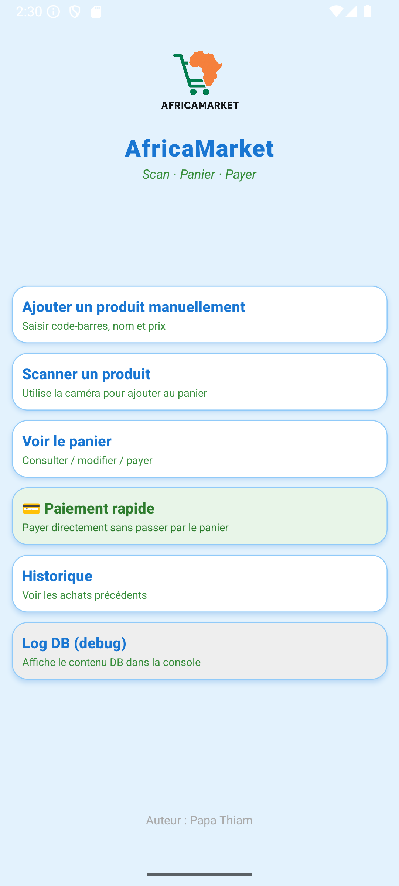
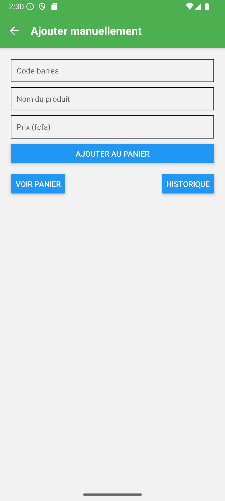
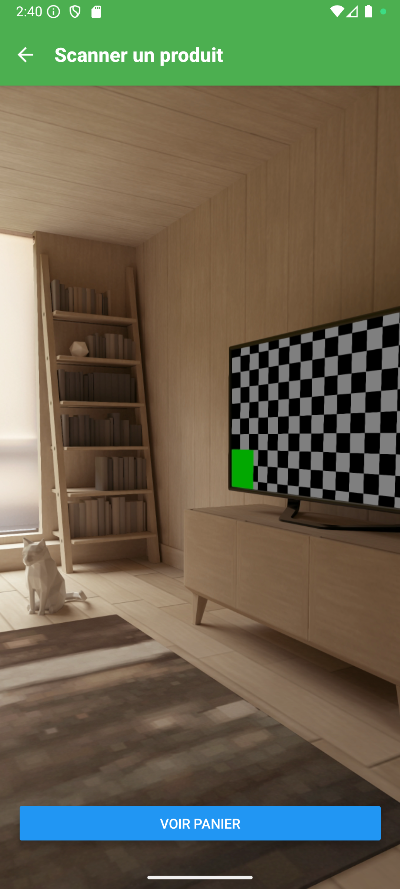
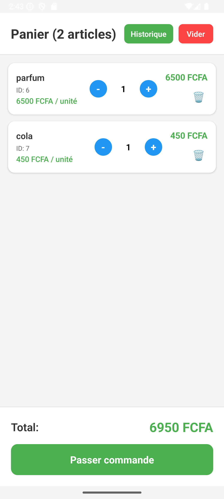
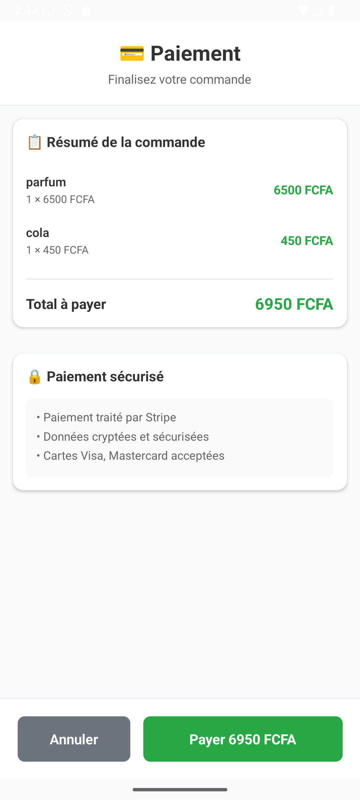
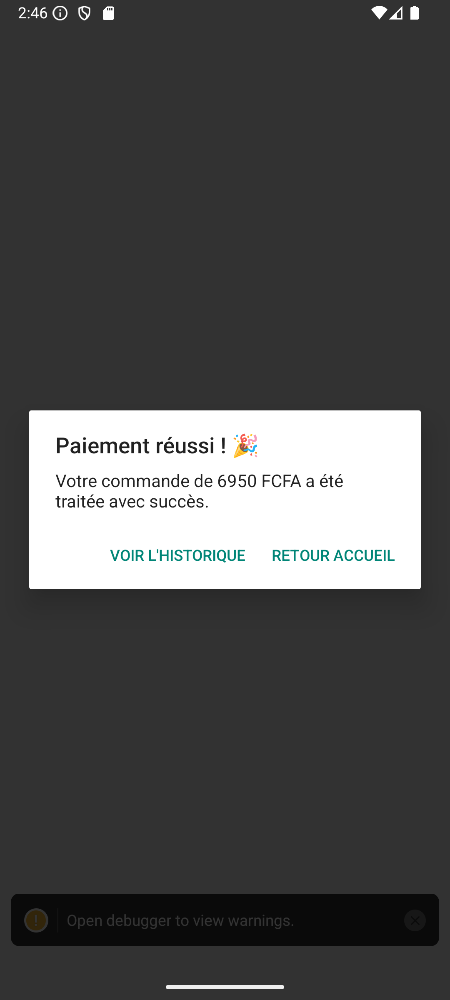
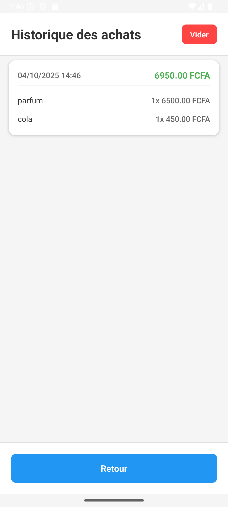
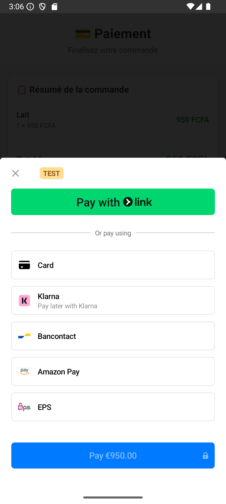

# 📱 AfricaMarket - Scanner Code-Barres

Ce projet de TP académique en M2 vise à développer une application mobile de  électronique avec scanner de code-barres ou ajout manuel de produits, gestion de panier, et paiements via Stripe. L'application est construite avec React Native pour le frontend et FastAPI pour le backend.


## Principales fonctionnalités

- Scanner de code‑barres via la caméra (ou saisie manuelle)
- Ajout automatique d'un produit au panier après lecture
- Ajout manuel avec presets rapides
- Gestion complète du panier (quantités, suppression)
- Paiement via Stripe PaymentSheet (client + backend)
- Historique des commandes persisté en SQLite (tables `orders` + `order_items`)
- Thème global Jour / Nuit + persistance

---

## Aperçus (captures d'écran)

Voici quelques captures d'écran extraites du dossier `client/assets/` pour te donner une idée :

<div style="display: flex; gap: 16px; margin-bottom: 16px;">
	
	
	
</div>
<div style="display: flex; gap: 16px; margin-bottom: 16px;">
	
	
	
</div>
<div style="display: flex; gap: 16px;">
	
	
</div>

---

## Structure du projet

```
barcode-scanner/
├─ client/        # React Native (Expo)
│  ├─ assets/      # images et icônes
│  ├─ screens/     # écrans (Barcode, Cart, History, ...)
│  └─ theme/       # ThemeProvider + toggle
├─ server/        # FastAPI (produits, paiements)
└─ Code-barre/    # scripts utilitaires
```

## Prérequis

- Node.js LTS
- npm ou yarn
- Expo CLI (optionnel mais pratique)
- Android Studio/Xcode ou un appareil mobile
- Python 3.8+ (backend)
- Compte Stripe (clé de test)

## Installation & exécution (rapide)

1) Backend

```bash
cd server
# avec Docker
docker compose logs -f
docker compose up --build

```

2) Frontend

```bash
cd client
npm install
# Lancer sur Android (ou via Expo devtools)
npm run android
```

### Remarques réseau

Si le backend tourne sur une autre machine du réseau local, met à jour la constante `apiUrl` dans `client/screens/*` pour pointer vers l'IP/port du serveur.

## Configuration Stripe

Définis les clés dans le backend (`.env`):

```
STRIPE_SK=sk_test_xxx
STRIPE_PK=pk_test_xxx
```

Dans `client/App.tsx`, remplace la clé publique de test par la tienne pour tester les paiements.

## Base de données locale (SQLite)

Le client utilise SQLite (expo-sqlite) et les tables :

- `cart` (panier actuel)
- `orders` (commandes payées)
- `order_items` (lignes de commandes)

Lors d'un paiement validé, le panier est transformé en `orders` + `order_items` dans une transaction.

## Endpoints backend (exemples)

- GET /items/                 — liste des produits
- POST /items/                — créer un produit
- GET /items/barcode/{code}   — récupérer produit par code‑barres
- POST /payments/             — initier un paiement (backend)

---


## Conseils de développement

- Vérifier les types : `npx tsc --noEmit` (depuis le dossier `client`)
- Utiliser les logs Metro / backend pour déboguer les appels réseau et la DB

## Dépannage

- Erreur caméra : vérifier les permissions (Camera.requestCameraPermissionsAsync()).
- Erreur backend : vérifier `apiUrl` et le réseau local.
- Erreur Stripe : vérifier clés et logs backend.

---

## Auteurs & Licence

Auteur : Papa Thiam — Projet M2 Programmation Mobile

Statut : en cours de finalisation
